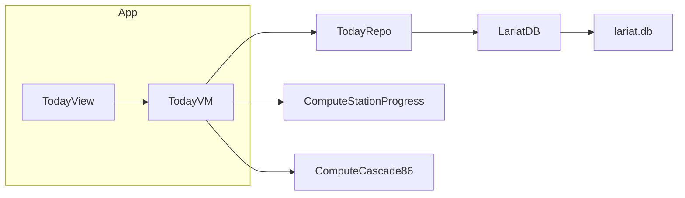

# feat: Lariat Native P2a — cook-tier today board (read-only)

## Summary

First **iPad-first** native slice: the **Today** shift board (`/v2/today`) as a read-only cook
surface in `LariatNative`, plus a **Cook** navigation section. Proves station progress aggregation,
open 86 listing, stock-move feed, and cascaded recipe impacts on shared `lariat.db` — zero writes,
no `audit_events`, no KDS fold-in yet.

## Problem Frame

Managers run native Command/Analytics/Costing/Management (P1). Cooks still need a browser for the
v2 cook loop starting at Today. P1a Command already **reads** `eighty_six` and line-check tables
as thin projections; cooks need the **operational** view (station grid, stats, deep links) before
we port 86 writes (P2b) and checklists (P2c).

## Requirements

| ID | Requirement |
|----|-------------|
| R1 | Add **Cook** sidebar section with **Today** active; stub destinations for 86 / Stations / KDS (disabled or "coming soon") until later sub-phases. |
| R2 | Render Today hero stats: ready stations, flagged count, open 86 count — matching `app/v2/today/page.jsx` logic for `shift_date = todayISO()` and default location. |
| R3 | Station grid: active line-check stations only (`activeLineCheckStations`); per-station tone + label from `stationProgress`. |
| R4 | Stock moves: last 4 `inventory_updates` rows for today/location (item, direction, delta). |
| R5 | 86 section when non-empty: open `eighty_six` items + `cascadedFromEightySix` chips (hot vs warm styling). |
| R6 | **Read-only** `LariatDatabase` only — no `LariatWriteDatabase` changes in P2a. |
| R7 | Polling refresh every 3 s (match P1a); cross-process web writes visible on next poll. |
| R8 | iPad + macOS layouts; tap targets ≥ 44 pt on iOS. Copy via short labels per `docs/UI_COPY_RULES.md` (port key strings from `lib/i18n/messages/en.ts` `today.*` — no SaaS jargon). |
| R9 | Per-section degrade on missing tables / empty data; never fail whole screen. |
| R10 | `swift test` green; new fixture coverage for Today aggregation. |

**Success criteria:** Today board numbers match web `/v2/today` for the seeded fixture DB; adding an
86 row from web appears on native after poll; station progress updates when web posts a line check.

## Key Technical Decisions

| ID | Decision | Rationale |
|----|----------|-----------|
| KTD1 | **P2a read-only** | Defers `AuditedWrite` to P2b; keeps first cook PR reviewable. |
| KTD2 | **Port `Compute/` pure fns** | `stationProgress` logic matches P1a pattern; unit-test without GRDB. |
| KTD3 | **Static stations/templates from JSON** | Mirror web `lib/data.ts` / `getStations` + `getLineCheckTemplate` — not in SQLite. Bundle or read from `LARIAT_DATA_DIR` if web drops JSON there (verify path parity in U1). |
| KTD4 | **iPad-first SwiftUI** | `NavigationSplitView` on iPad; single column stack on compact width. |
| KTD5 | **No i18n framework P2a** | English strings inline matching en catalog; i18n port deferred (web uses `t()`). |
| KTD6 | **Deep links inert** | Station cards visible but navigation to checklist disabled until P2c (or show read-only detail). |

## High-Level Technical Design

**Data sources (single `load()` or parallel reads):**

1. `getStations()` + `stationProgress` per station
2. `SELECT item FROM eighty_six WHERE shift_date AND resolved_at IS NULL`
3. `SELECT item, direction, delta FROM inventory_updates … LIMIT 4`
4. `cascadedFromEightySix(activeItems, recipes)`

## Scope Boundaries

### In scope

- `TodayBoardRepository`, compute ports, `TodayView` + view model, Cook nav shell, tests.

### Deferred (P2b–P2d)

- 86 add/resolve writes + `audit_events`
- Station checklist UI + `/api/checks` parity
- KDS punch + `LariatKDSCore` fold-in
- Full i18n / es locale

### Outside identity

- Schema migrations, web API HTTP proxy for reads

## Implementation Units

### U1. Station catalog + compute ports

**Goal:** Pure Swift equivalents of `stationProgress`, `activeLineCheckStations`, `cascadedFromEightySix`.

**Files (new):**

- `LariatNative/Sources/LariatModel/Compute/StationProgress.swift`
- `LariatNative/Sources/LariatModel/Compute/SubRecipeCascade.swift`
- `LariatNative/Sources/LariatModel/StationCatalog.swift` (load stations + line-check templates)
- `LariatNative/Tests/LariatModelTests/StationProgressTests.swift`

**Patterns:** `Compute/CommandSummary.swift`, `lib/stationProgress.js`, `lib/subRecipeGraph.ts`

**Verification:** Fixture parity vs known web-computed values.

### U2. Today board repository

**Goal:** GRDB fetches for 86 list, inventory moves, line-check rows needed by compute.

**Files (new):**

- `LariatNative/Sources/LariatDB/TodayBoardRepository.swift`
- `LariatNative/Tests/LariatDBTests/TodayBoardRepositoryTests.swift`

**Verification:** In-memory DB fixture; counts match SQL expectations.

### U3. Today UI + Cook navigation

**Goal:** iPad/macOS Today screen wired into app shell.

**Files (modify/new):**

- `LariatNative/Sources/LariatApp/TodayView.swift`
- `LariatNative/Sources/LariatApp/CookSection.swift` (enum + sidebar entries)
- `LariatNative/Sources/LariatApp/LariatApp.swift` (Cook section in sidebar)

**Patterns:** `ManagementRollupView.swift` polling, `app/v2/today/page.jsx` layout hierarchy

**Verification:** Manual smoke `swift run LariatApp` on Mac; Xcode iPad simulator.

### U4. Integration tests + docs pointer

**Goal:** README or `LariatNative/README.md` note for Cook tier; ensure CI runs iOS build if not already.

**Verification:** `cd LariatNative && swift test`; optional `xcodebuild` iOS destination smoke.

## Risks and Dependencies

| Risk | Mitigation |
|------|------------|
| Station JSON not found at runtime | Document `LARIAT_DATA_DIR` / bundle copy strategy in U1 |
| Recipe graph drift | Seed recipes in test fixture from web export |
| iOS build breaks CI | Gate iOS compile in existing workflow or add matrix row |

**Depends on:** `main` at P1b merge (`3ab3c84`+).

## Open questions (resolve in U1 spike)

| Question | Default if unanswered |
|----------|----------------------|
| Bundle `stations.json` / recipes in app vs read from data dir? | Bundle minimal fixture subset for tests; runtime read from same paths as web `lib/data` |
| Station card tap behavior P2a? | Read-only detail sheet (station name + progress numbers) — no checklist until P2c |

## References

- Design: `docs/superpowers/specs/2026-06-17-lariat-native-p2-cook-tier-design.md`
- Web: `app/v2/today/page.jsx`, `lib/stationProgress.js`, `lib/lineSummary.ts`
- Tests: `tests/js/test-v2-today.mjs`
- iPad: `docs/audit/2026-06-07-ipad-performance-profile.md`
