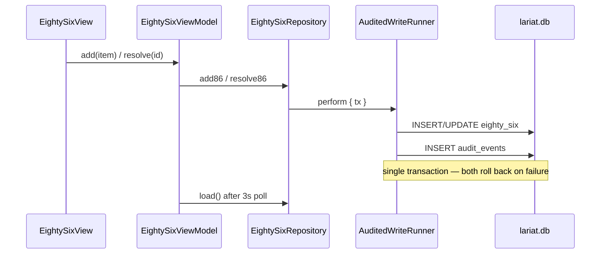

# feat: Lariat Native P2b — 86 board writes (first cook AuditedWrite)

**Status:** Shipped on `main` via [#350](https://github.com/sburdges-eng/Lariat/pull/350) (2026-06-17). P2c (#355) and P2d (#357) followed on the same cook-tier ladder.

## Implementation status

| Unit | Deliverable | Status |
|------|-------------|--------|
| U1 | `nativeCook`, Encodable audit payloads, `AuditEventWriter` | Done |
| U2 | `StaffCatalog`, `CookIdentityStore`, staff picker | Done |
| U3 | `EightySixRepository` + `EightySixRepositoryTests` | Done |
| U4 | `EightySixView`, Cook nav, Today deep link | Done |
| U5 | `LariatNative/README.md` cook-tier docs | Done |

## Summary

Ship the native **86 board** for cooks: list open items, add new 86 rows, resolve when back on menu, and confirm cascade chips — all against shared `lariat.db` with **transactional `audit_events`** parity. This is the first **cook-tier** production use of `AuditedWriteRunner` + `AuditEventWriter` (manager-tier performance reviews already use the same runner in P1b).

## Problem Frame

P2a delivers read-only Today (station grid, open 86 count, cascade display). Cooks still need a browser for `/v2/eighty-six` to mark items out or back. P1a Command reads `eighty_six` as thin projections; cooks need the **operational write loop** with regulated audit trail before station checklists (P2c) and KDS punch (P2d).

## Planning questionnaire (Q1–Q5, Q7, Q9)

Canonical answers live in `docs/superpowers/specs/2026-06-17-lariat-native-p2b-86-board-design.md`.
Summary for implementers:

| Q | Topic | Binding decision |
|---|--------|------------------|
| Q1 | Problem | First cook **write** after read-only Today; closes browser dependency for 86 |
| Q2 | Scope | 86 add/resolve + cascade confirm only; no RuleGate, no idempotency table |
| Q3 | Success | `swift test` + fixture parity with `test-eighty-six-api.mjs`; poll-visible cross-process |
| Q4 | Approach | **U1 write foundation before UI** — `nativeCook`, payload encoding, `AuditedWriteRunner` |
| Q5 | Identity | `lariat_cook` + staff picker; `actor_source=native_cook`; cascade read-only + manual confirm add |
| Q7 | Tests | Seed Swift fixtures from same SQL shapes as JS API tests; repository tests before UI merge |
| Q9 | Deferrals | See scope table below — `syncFeed`, HTTP idempotency, non-listed HACCP, KDS Core fold-in |

### Write-foundation gate (before P3 UI)

P2b lands `RegulatedWriteContext.nativeCook` and `payloadJSON` encoding. P3a **must** add before temp-log UI:

- `RuleGateError` + `WriteErrorMapper.needsCorrectiveAction` branch
- `TempLogCompute` pure port of `validateTempReading` / `classifyReading` + boundary tests
- Then `TempLogRepository` + `TempLogView`

## Requirements

| ID | Requirement |
|----|-------------|
| R1 | Enable **Cook → 86** navigation; wire Today "86 right now" deep link to the board. |
| R2 | **List** today's open 86 rows for default location + `shift_date = todayISO()`; include resolved-today history (last 50) matching web board. |
| R3 | **Cascade section** when active items trigger `cascadedFromEightySix`; inline confirm posts dependent item with `reason: prep_short`. |
| R4 | **Add 86** — item required; optional station, kind, reason, quantity; `shift_date` defaults to today (no back-date in P2b). |
| R5 | **Resolve** — set `resolved_at` + `resolved_by`; audit `action=update`, `note=resolved`. |
| R6 | **Location IDOR guard** on resolve — snapshot row, compare `location_id` to caller scope; treat cross-location as 404 (not 403). |
| R7 | **Atomic audit** — source INSERT/UPDATE + `audit_events` in one GRDB transaction via `AuditedWriteRunner`; audit failure rolls back source row. |
| R8 | **Cook identity** — persist `cook_id` per shift (`UserDefaults` key `lariat_cook`); **staff picker** from `data/cache/staff.json` (active cooks only); pass selected `id` to `cook_id` and `actor_cook_id` on audit rows. |
| R9 | **`actor_source`** — use `native_cook` for all cook-tier regulated writes (distinct from web `api` / `cook_ui`). |
| R10 | **Polling refresh** — 3 s after writes; cross-process visibility when web also writes 86. |
| R11 | **UI copy** — kitchen labels per `docs/UI_COPY_RULES.md`; match `lib/i18n/messages/en.ts` `shells.eightySix.*` / reason codes. |
| R12 | **Error UX** — 409 on double-resolve; empty item blocked; busy DB via `WriteErrorMapper`; no raw SQLite errors. |
| R13 | **Double-submit guard** — in-flight `Set` on add/resolve (web `addingRef` pattern). |
| R14 | `swift test` green; repository tests mirror `tests/js/test-eighty-six-api.mjs` and `test-financial-acid.mjs` §86 semantics. |

**Success criteria:** Seeded fixture parity with web API for add/resolve/IDOR/409; web add appears on native within one poll; native resolve updates Command open-86 count within poll; financial-acid atomicity holds in Swift tests.

## Key Technical Decisions

| ID | Decision | Rationale |
|----|----------|-----------|
| KTD1 | **Reuse shipped `AuditedWriteRunner`** | `AuditEventWriter` + outside-tx throw already tested; P2b is first cook consumer, not new infrastructure. |
| KTD2 | **No `RuleGate` in P2b** | 86 has no `needs_corrective_action` contract (see origin §5); defer to P3. |
| KTD3 | **No HTTP idempotency table** | Native writes direct SQL; client in-flight guard only. Web `withIdempotency` not ported until needed. |
| KTD4 | **`RegulatedWriteContext.nativeCook`** | Extend `AuditEvent.swift` with cook actor source + optional cook id; mirror `nativeMac` pattern. |
| KTD5 | **Structured audit payload** | **Insert:** partial `{ item, kind, reason }` (web POST). **Resolve:** full updated row JSON. Extend `AuditEventInput` beyond `[String:String]` for resolve parity. |
| KTD9 | **Add uses caller location scope** | Native add always uses `LocationScope.resolve()` — never body-asserted `location_id` (stricter than web `locationFromBody`). |
| KTD6 | **Allow duplicate open rows** | No DB unique constraint on item; match web behavior. |
| KTD7 | **Recipe graph from same JSON as P2a** | `SubRecipeCascade` + bundled/read `getRecipes()` source for cascade chips. |
| KTD8 | **Today-only `shift_date` on add** | Back-date is P3 PIN territory (`temp-log` pattern). |

## High-Level Technical Design

## Scope Boundaries

### In scope

- `EightySixRepository`, `EightySixView` + view model, cook nav enablement, Today deep link, cook identity store, tests.

### Deferred to P2c–P2d

- Station line checks + signoff
- KDS punch + `LariatKDSCore` fold-in

### Deferred to P3+ (Q9 — do not expand P2b PR)

| Deferred item | Target phase |
|---------------|--------------|
| `RuleGate` / corrective-action 422 UX | P3a temp log (foundation types before UI) |
| HACCP temp logs | P3a |
| Date marks, calibrations | P3b |
| Cleaning, labor breaks | P3c |
| Cooling, receiving, sanitizer, sick-worker | P3d+ |
| `syncFeed` writes | P6+ |
| HTTP `withIdempotency` / `idempotency_keys` | P2d+ / when client replay required |
| `LariatKDSCore` package fold-in (display grid) | P2d follow-up |
| KDS `idempotency_keys` table | P2d follow-up |
| Break COMPS shift-window UI | P3c follow-up (evaluation logic may ship first) |

### Outside identity

- Schema migrations; web route changes; `syncFeed` (P6)

## Implementation Units

### U1. Cook write context + audit payload encoding

**Goal:** `RegulatedWriteContext.nativeCook(cookId:)` and audit payload encoding that accepts structured row snapshots.

**Flow 1 entry (same PR or immediately after U1):** Enable Cook → 86 nav and Today deep link — otherwise P2a stubs leave cooks disconnected from the write loop (see design spec §Navigation wiring).

**Requirements:** R8, R9, KTD4, KTD5

**Dependencies:** None

**Files:**

- `LariatNative/Sources/LariatModel/AuditEvent.swift` (modify)
- `LariatNative/Sources/LariatDB/AuditEventWriter.swift` (modify — `Encodable` payload path)
- `LariatNative/Tests/LariatDBTests/AuditEventWriterTests.swift` (modify)

**Approach:** Add `nativeCookActorSource = "native_cook"`; factory on `RegulatedWriteContext`. Extend `safePayloadJSON` to encode `Encodable` row structs for resolve parity.

**Patterns:** `RegulatedWriteContext.nativeMac`, `lib/auditEvents.ts` payload serialization

**Test scenarios:**

- Happy path: encode resolve payload with numeric fields preserved in JSON.
- Edge case: nil optional fields omitted from payload.
- Error path: `post` outside transaction throws `AuditEventWriterError.outsideTransaction`.
- Integration: rollback drops both `eighty_six` and `audit_events` when audit insert fails mid-txn.

**Verification:** `AuditEventWriterTests` green; payload round-trip decodable.

### U2. Cook identity store + staff picker

**Goal:** Shift-persistent cook id for attribution on 86 rows and audit events, chosen from the live staff roster.

**Requirements:** R8

**Dependencies:** None

**Files:**

- `LariatNative/Sources/LariatModel/StaffCatalog.swift` (new — load `staff.json`, filter active displayable rows)
- `LariatNative/Sources/LariatApp/CookIdentityStore.swift` (new)
- `LariatNative/Sources/LariatApp/CookIdentityPicker.swift` (new — sheet with staff list)
- `LariatNative/Tests/LariatModelTests/StaffCatalogTests.swift` (new)

**Approach:** Load `data/cache/staff.json` via `resolveCacheDirectory` (same as `StationCatalog`). Port `lib/staffDisplay.ts` filter rules (`isDisplayableStaff`, `formatStaffDisplayName`) — drop junk ids (`non_usable_employee`), inactive rows, placeholder names. Picker shows `displayName`; persisted value is staff `id` string in `UserDefaults` key `lariat_cook`. Prompt on first write if unset; allow "Skip for now" (null cook_id, match web). Fallback: if `staff.json` missing, degrade to free-text field with warning banner.

**Patterns:** Web `localStorage.lariat_cook`, `lib/staffDisplay.ts`, `StationCatalog.load`

**Test scenarios:**

- Happy path: pick `tyler_chambers` → `lariat_cook` stored → writes include `cook_id` and `actor_cook_id`.
- Edge case: inactive / junk staff rows excluded from picker list.
- Edge case: missing `staff.json` → free-text fallback; writes still allowed.
- Error path: unset cook id → prompt before first add/resolve; skip leaves null attribution (web parity).

**Verification:** `StaffCatalogTests` with fixture JSON; manual picker smoke on iPad.

### U3. EightySixRepository (read + audited write)

**Goal:** GRDB repository mirroring `app/api/eighty-six/route.ts` and `resolve/route.ts`.

**Requirements:** R2–R7, R14

**Dependencies:** U1

**Files:**

- `LariatNative/Sources/LariatDB/EightySixRepository.swift` (new)
- `LariatNative/Sources/LariatModel/Records.swift` (modify if row types need resolve fields)
- `LariatNative/Tests/LariatDBTests/EightySixRepositoryTests.swift` (new)
- `LariatNative/Tests/LariatDBTests/Fixtures.swift` (modify — 86 seed rows)

**Approach:**

- `load(date:location:)` → open rows + cascaded chips via `SubRecipeCascade`.
- `add(...)` → `AuditedWriteRunner.perform` → INSERT + audit `action=insert` with partial payload `{ item, kind, reason }`; `location_id` from `LocationScope.resolve()` only.
- `resolve(id:context:)` → **transaction port of `resolve/route.ts`:** snapshot by id; cross-location → `notFound` (404, no leak); `resolved_at` set → `alreadyResolved` (409); UPDATE + audit `note=resolved` with full-row `payloadJSON`.

**Patterns:** `PerformanceReviewsRepository.create`, `app/api/eighty-six/resolve/route.ts`

**Test scenarios:**

- Happy path: add salmon → row + audit insert share txn.
- Happy path: resolve open row → `resolved_at` set + update audit.
- Edge case: cross-location resolve → error equivalent to 404; row unchanged.
- Edge case: double resolve → 409 equivalent; single update audit only.
- Error path: empty item → validation error before txn.
- Integration: concurrent add from fixture does not corrupt cascade list.

**Verification:** Parity with `tests/js/test-eighty-six-api.mjs` cases; `test-financial-acid.mjs` §86 atomicity.

**Fixture rule (Q7):** Seed `Fixtures.swift` / test helpers from the same INSERT column sets as the JS API test file — parity is CI-enforced, not manual iPad smoke.

### U4. EightySixView + navigation wiring

**Goal:** iPad-first 86 board UI; enable Cook nav; Today deep link.

**Requirements:** R1, R3, R10–R13

**Dependencies:** U2, U3

**Files:**

- `LariatNative/Sources/LariatApp/EightySixView.swift` (new)
- `LariatNative/Sources/LariatApp/EightySixViewModel.swift` (new)
- `LariatNative/Sources/LariatApp/CookSection.swift` (modify — enable `.eightySix`)
- `LariatNative/Sources/LariatApp/LariatApp.swift` (modify — route + inject write DB)
- `LariatNative/Sources/LariatApp/TodayView.swift` (modify — deep link)

**Approach:** Match `EightySixBoard.jsx` sections — add form, active list, cascade confirm, resolved history. Port reason **codes** verbatim (`out`, `spoiled`, `dropped`, `no_make`, `burned`, `prep_short`, `other`) — labels from en catalog. 3 s `Task` poll. Per-row `resolvingRef` + form `addingRef` in-flight guards.

**Patterns:** `TodayView.swift`, `app/eighty-six/EightySixBoard.jsx`

**Test scenarios:**

- Happy path: add from form → list refreshes with new row.
- Happy path: cascade confirm → dependent row appears.
- Edge case: double-tap add → single row (UI test or view model unit test).
- Error path: resolve already-resolved row shows cook-friendly message.

**Verification:** Manual iPad simulator + Mac smoke; Command open count updates after poll.

### U5. Docs + README

**Goal:** Document cook write tier, `native_cook` actor source, P2c stub status.

**Requirements:** R9

**Dependencies:** U4

**Files:**

- `LariatNative/README.md` (modify)

**Test expectation:** none — documentation only.

**Verification:** README lists P2b shipped; P2c–P2d tracked in their own plans (#355, #357).

## Risks and Dependencies

| Risk | Mitigation |
|------|------------|
| Audit payload shape drift vs web | U1 encoding tests; compare fixture JSON to web export |
| Cook identity unset | U2 staff picker + skip path; audits valid with null cook |
| Cross-process WAL races | 409 guards + poll; document no idempotency keys |
| iPad accidental resolve | Match web single-tap; optional confirm deferred |

**Depends on:** P2a merged (`TodayBoardRepository`, `SubRecipeCascade`, Cook shell).

## Open Questions

| Question | Resolution |
|----------|------------|
| Staff picker vs free-text cook id? | **Resolved:** staff picker from `data/cache/staff.json` with free-text fallback when file missing. |
| Resolve confirmation dialog? | No — match web |

## References

- Design (P2b): `docs/superpowers/specs/2026-06-17-lariat-native-p2b-86-board-design.md`
- Umbrella: `docs/superpowers/specs/2026-06-17-lariat-native-p2-cook-tier-design.md` §5–6
- Web: `app/api/eighty-six/route.ts`, `app/api/eighty-six/resolve/route.ts`, `app/eighty-six/EightySixBoard.jsx`
- Patterns: `docs/PATTERNS.md` §3, `docs/HEALTH_SAFETY_LABOR_AUDIT.md` (atomicity)
- Tests: `tests/js/test-eighty-six-api.mjs`, `tests/js/test-financial-acid.mjs`, `tests/js/test-v2-eighty-six.mjs`
