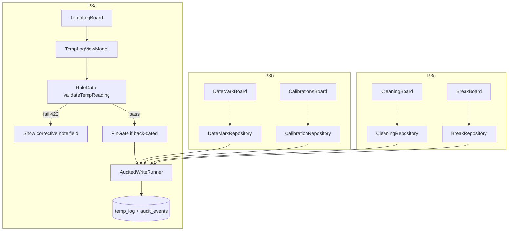

# feat: Lariat Native P3 — HACCP + labor (RuleGate + audited writes)

## Summary

First **heavy regulated write phase** on Lariat Native: port HACCP and labor surfaces with **`RuleGate`** (422 `needs_corrective_action`), **`PinGate`** where web requires manager PIN, and **`AuditedWrite`** transactionality on every mutation. Split into sub-phases for reviewability — temp-log proves RuleGate; date marks, calibrations, cleaning, and breaks follow.

## Problem Frame

P2b establishes cook `AuditedWrite` on 86 (no RuleGate). Food-safety and labor boards remain web-only despite mature rule engines in `lib/*.ts` and hardened API routes (`docs/HEALTH_SAFETY_LABOR_AUDIT.md`). Native has **thin Compute ports** (`TempLogCompute` breach-count only for Command; `DateMarkCompute` / `ProbeCompute` partial) — not full write-path validators. No write repos, no `RuleGate` implementation, no **temp-PIN scope** checker (`haccp.back_date`), and `WriteErrorMapper` lacks corrective-action UX.

P0 ladder defines P3 as **rule engine + 422 gates + audit transactionality** — the phase where `InvariantContracts.RuleGate` stops being a stub.

## Requirements

| ID | Requirement |
|----|-------------|
| R1 | **`RuleGate` protocol** — pre-txn validation; out-of-range readings without corrective note fail before any DB write. |
| R2 | **422 UX** — map `RuleGateError.needsCorrectiveAction` to inline note expansion (match `TempLogBoard.jsx`); cook copy per `docs/UI_COPY_RULES.md`. |
| R3 | **P3a: Temp log** — per-point board; in-range + corrective-note paths; back-date PIN when `LARIAT_PIN` set (`haccp.back_date` scope). |
| R4 | **P3b: Date marks** — create with computed `discard_on`; discard with reason enum; 409 on double discard. |
| R5 | **P3b: Thermometer calibrations** — POST persists pass **and** fail readings; altitude-aware targets. |
| R6 | **P3c: Cleaning** — tick against schedule; `validateCleaningLog` → 400 only (no 422 path). |
| R7 | **P3c: Breaks** — start meal/rest; 409 if open break; end with duration; waived meal requires `waiver_ref`. |
| R8 | **AuditedWrite on every mutation** — source row + `audit_events` in one txn; stricter than web warn-only (native throws outside txn). |
| R9 | **PinGate reuse** — `PinVerifier` + `PinSessionStore` from P1b for back-date temp and any web-PIN-gated route. |
| R10 | **Compute-first** — pure Swift rule modules in `LariatModel/Compute/` ported from `lib/*.ts`; UI never embeds thresholds. |
| R11 | **Location scope** — `DEFAULT_LOCATION_ID` / env parity; cross-location IDOR guards on PATCH routes (mirror breaks/resolve). |
| R12 | **Polling refresh** — 3 s on boards; cross-process WAL with web writers. |
| R13 | **Do not weaken validations** — AGENTS.md #4; no silent auto-correct of HACCP records. |
| R14 | `swift test` + existing `tests/js/test-*-api.mjs` parity bars remain green on web; native adds fixture tests per surface. |

**Success criteria:** Temp-log out-of-range without note produces zero rows; with note persists yellow classification + audit; back-date blocked without PIN when env PIN set; breaks 409 surfaces actionable copy; each surface matches web fixture outputs for rule classification.

## Key Technical Decisions

| ID | Decision | Rationale |
|----|----------|-----------|
| KTD1 | **Sub-phases P3a → P3b → P3c** | Temp-log proves RuleGate + 422 UX before spreading pattern to four more surfaces. |
| KTD2 | **`RuleGate` before txn, `AuditedWrite` inside** | Validation failures must not write partial state; matches web route order. |
| KTD3 | **Extend `WriteErrorMapper`** | Add `needsCorrectiveAction`, `alreadyResolved`, `openBreakExists` branches with kitchen copy. |
| KTD4 | **Defer cooling, receiving, sanitizer, sick-worker** | Listed in audit doc but out of P3 scope; add P3d+ if needed. |
| KTD5 | **No `syncFeed` writes** | Web temp-log appends sync feed; native skips until P6 (document intentional). |
| KTD6 | **Empty reading guard** | `reading.trim().isEmpty` before parse — avoid `0°F` false positive (`test-temp-log-api.mjs`). |
| KTD7 | **Corrective note max 500** | Reject overlong with validation error, not silent truncate. |
| KTD8 | **Top-level Safety sidebar** | New **Safety** section (not nested under Cook) with Food Safety + Labor tiles — matches web `/food-safety` hub prominence. |
| KTD9 | **Temp PIN scope port required** | `PinVerifier` only checks manager PIN / `LARIAT_PIN`; back-date temp-log needs `hasPinOrTempPin(..., 'haccp.back_date')` parity (`lib/pin.ts`, `lib/tempPin.ts`). |

## High-Level Technical Design

**RuleGate error taxonomy (native):**

| Error | UX | DB write |
|-------|-----|----------|
| `needsCorrectiveAction` | Inline note sheet | None |
| `pinRequired` | PIN sheet (`haccp.back_date`) | None |
| `validationFailed` | 400-style banner | None |
| `conflict` (409) | Actionable copy (open break, already discarded) | None |
| `calibrationWarning` | Advisory banner (write proceeds) | Yes — after advisory shown |

## Scope Boundaries

### In scope (by sub-phase)

| Sub-phase | Surfaces |
|-----------|----------|
| **P3a** | Temp log board + `RuleGate` + `WriteErrorMapper` + hub shell |
| **P3b** | Date marks, thermometer calibrations |
| **P3c** | Cleaning ticks, labor breaks |

### Deferred to follow-up work

- P2c station line checks (may share RuleGate patterns but separate PR cycle)
- P2d KDS punch
- P3d+: cooling, receiving, sanitizer, sick-worker, corrective-actions feed UI
- P6 `syncFeed` / multi-instance replay
- Full i18n

### Outside identity

- Schema migrations; weakening HACCP thresholds; web route rewrites

## Phased Delivery

### Phase P3a — Temp log (RuleGate proof)

### Phase P3b — Date marks + calibrations

### Phase P3c — Cleaning + breaks

Each sub-phase is an independent PR after the prior merges.

**Execution shape (confirmed):** Keep this single plan document. **`/ce-work` targets one sub-phase at a time** — default **P3a U1–U4 only**. Do not implement U5–U9 in one batch.

## Implementation Units

### U1. RuleGate + temp-PIN scope + WriteErrorMapper

**Goal:** Implement `RuleGate` as typed errors; port temp-PIN scope checks; extend mapper for cook-facing copy.

**Requirements:** R1, R2, R9, R13

**Dependencies:** None

**Files:**

- `LariatNative/Sources/LariatModel/InvariantContracts.swift` (modify — default extension or wrapper)
- `LariatNative/Sources/LariatModel/RuleGateError.swift` (new)
- `LariatNative/Sources/LariatModel/TempPinVerifier.swift` (new — `hasScope`, `hashPin`, `temp_pins` lookup)
- `LariatNative/Sources/LariatModel/WriteErrorMapper.swift` (modify)
- `LariatNative/Tests/LariatModelTests/RuleGateErrorTests.swift` (new)
- `LariatNative/Tests/LariatModelTests/TempPinVerifierTests.swift` (new)
- `LariatNative/Tests/LariatModelTests/WriteErrorMapperTests.swift` (modify)

**Approach:** `RuleGateError.needsCorrectiveAction(pointId:)`. `TempPinVerifier.hasPinOrScope(db:pin:scope:)` mirrors `lib/pin.ts` `hasPinOrTempPin` — master PIN **or** active `temp_pins` row with `haccp.back_date` scope. `WriteErrorMapper.message(for:)` returns short kitchen strings.

**Patterns:** `docs/PATTERNS.md` §1 (422 contract), `app/food-safety/temp-log/TempLogBoard.jsx`

**Test scenarios:**

- Happy path: in-range validation passes silently.
- Edge case: out-of-range without note → `needsCorrectiveAction`.
- Edge case: empty reading string → validation failed (not 0°F).
- Error path: corrective note > 500 chars → validation failed.

**Verification:** Pure unit tests; no GRDB required.

### U2. Temp log compute parity (P3a)

**Goal:** Port `lib/tempLog.ts` validators and classifiers to Swift.

**Requirements:** R3, R10

**Dependencies:** U1

**Files:**

- `LariatNative/Sources/LariatModel/Compute/TempLogCompute.swift` (modify/expand)
- `LariatNative/Tests/LariatModelTests/TempLogComputeTests.swift` (new)

**Approach:** **Greenfield expand** — existing `TempLogCompute` only powers Command breach counts (see file header PARITY NOTE). Port full `validateTempReading`, `classifyReading`, snapshotted limits on write, and point metadata for the board from `lib/tempLog.ts`; fixture vectors from `tests/js/test-temp-log-rules.mjs`.

**Patterns:** `Compute/StationProgress.swift`, `lib/tempLog.ts`

**Test scenarios:**

- Happy path: walk-in in-range → green classification.
- Edge case: cook_poultry 165°F boundary.
- Edge case: out-of-range requires note flag from validator.
- Integration: classification matches web output for seeded fixture vector set.

**Verification:** Byte/compare against known web rule outputs.

### U3. TempLogRepository + audited writes (P3a)

**Goal:** GRDB write path with RuleGate → PinGate → AuditedWrite.

**Requirements:** R3, R8, R9, R11

**Dependencies:** U1, U2, P2b `RegulatedWriteContext.nativeCook` (or duplicate cook-context slice in P3a if P2b not merged)

**Files:**

- `LariatNative/Sources/LariatDB/TempLogRepository.swift` (new)
- `LariatNative/Tests/LariatDBTests/TempLogRepositoryTests.swift` (new)
- `LariatNative/Tests/LariatDBTests/Fixtures.swift` (modify — temp_log seeds)

**Approach:** `postReading` calls RuleGate before `AuditedWriteRunner.perform`; PinGate for `shift_date != today` when PIN env set; audit `note: out_of_range:<point>` when applicable.

**Patterns:** `app/api/temp-log/route.js`, `tests/js/test-haccp-audit-atomicity.mjs`

**Test scenarios:**

- Happy path: in-range today → INSERT + audit.
- Covers AE-style: out-of-range no note → zero rows (mirror `test-temp-log-api.mjs`).
- Happy path: out-of-range with note → INSERT + audit with note field.
- Error path: back-date without PIN → pin required.
- Integration: audit failure rolls back temp_log row.

**Verification:** Repository tests + manual cross-check with web POST on shared DB.

### U4. TempLogBoard UI + food-safety hub (P3a)

**Goal:** iPad board with tile grid, corrective note expansion, calibration warning display.

**Requirements:** R2, R12

**Dependencies:** U3

**Files:**

- `LariatNative/Sources/LariatApp/FoodSafetyHubView.swift` (new)
- `LariatNative/Sources/LariatApp/TempLogView.swift` (new)
- `LariatNative/Sources/LariatApp/TempLogViewModel.swift` (new)
- `LariatNative/Sources/LariatApp/LariatApp.swift` (modify — hub nav)

**Patterns:** `app/food-safety/temp-log/TempLogBoard.jsx`, `app/food-safety/page.jsx`

**Test scenarios:**

- Happy path: submit in-range reading → tile turns green on poll.
- Edge case: 422 path shows note field without dismissing form.
- Error path: probe calibration warning shown as advisory banner; write still succeeds.

**Verification:** iPad simulator smoke; tile colors match web for same fixture DB.

### U5. Date marks compute + repository (P3b)

**Goal:** Create and discard flows with audit.

**Requirements:** R4, R8, R10

**Dependencies:** U1 (no RuleGate 422 — validation 400 only)

**Files:**

- `LariatNative/Sources/LariatModel/Compute/DateMarkCompute.swift` (modify)
- `LariatNative/Sources/LariatDB/DateMarkRepository.swift` (new)
- `LariatNative/Tests/LariatModelTests/DateMarkComputeTests.swift` (new)
- `LariatNative/Tests/LariatDBTests/DateMarkRepositoryTests.swift` (new)

**Patterns:** `lib/dateMarks.ts`, `app/api/date-marks/route.js`

**Test scenarios:**

- Happy path: create mark → `discard_on` computed + audit insert.
- Edge case: discard with valid reason enum.
- Error path: double discard → 409 equivalent.
- Integration: PATCH location IDOR → 404 semantics.

**Verification:** `tests/js/test-date-marks-api.mjs` parity cases.

### U6. Calibrations compute + repository (P3b)

**Goal:** POST calibration record; fail readings persist.

**Requirements:** R5, R8

**Dependencies:** U1

**Files:**

- `LariatNative/Sources/LariatModel/Compute/ProbeCompute.swift` (modify)
- `LariatNative/Sources/LariatDB/CalibrationRepository.swift` (new)
- `LariatNative/Tests/LariatDBTests/CalibrationRepositoryTests.swift` (new)

**Patterns:** `lib/calibrations.ts`, `tests/js/test-calibrations-api.mjs`

**Test scenarios:**

- Happy path: pass calibration → row + audit.
- Happy path: fail calibration → row persisted (not rejected).
- Edge case: altitude env affects target range in compute tests.

**Verification:** Rule + repository tests green.

### U7. Date marks + calibrations UI (P3b)

**Goal:** Boards wired into food-safety hub.

**Requirements:** R12

**Dependencies:** U5, U6

**Files:**

- `LariatNative/Sources/LariatApp/DateMarkView.swift` (new)
- `LariatNative/Sources/LariatApp/CalibrationsView.swift` (new)

**Test scenarios:**

- Happy path: create date mark from form → list refresh.
- Error path: discard already-discarded shows cook-friendly 409 copy.

**Verification:** Manual smoke on shared DB.

### U8. Cleaning repository + UI (P3c)

**Goal:** Schedule tick writes with audit.

**Requirements:** R6, R8

**Dependencies:** U1

**Files:**

- `LariatNative/Sources/LariatModel/Compute/CleaningCompute.swift` (new)
- `LariatNative/Sources/LariatDB/CleaningRepository.swift` (new)
- `LariatNative/Sources/LariatApp/CleaningView.swift` (new)
- `LariatNative/Tests/LariatDBTests/CleaningRepositoryTests.swift` (new)

**Patterns:** `lib/cleaning.ts`, `tests/js/test-cleaning-api.mjs`

**Test scenarios:**

- Happy path: tick task → INSERT cleaning_log + audit.
- Error path: invalid task id → 400 before txn.

**Verification:** API parity fixture.

### U9. Breaks compute + repository + UI (P3c)

**Goal:** Start/end/waive break flows with COMPS evaluation on read.

**Requirements:** R7, R8, R9

**Dependencies:** U1

**Files:**

- `LariatNative/Sources/LariatModel/Compute/BreakCompute.swift` (new)
- `LariatNative/Sources/LariatDB/BreakRepository.swift` (new)
- `LariatNative/Sources/LariatApp/BreakBoardView.swift` (new)
- `LariatNative/Tests/LariatModelTests/BreakComputeTests.swift` (new)
- `LariatNative/Tests/LariatDBTests/BreakRepositoryTests.swift` (new)

**Patterns:** `lib/breaks.ts`, `app/api/breaks/route.js`

**Test scenarios:**

- Happy path: start rest break → open row + audit.
- Error path: start while open break → 409 with `open_break_id` mapped to actionable copy.
- Happy path: end break → duration computed + audit update.
- Error path: waived meal without `waiver_ref` → validation failed.

**Verification:** `tests/js/test-breaks-api.mjs` parity.

### U10. Documentation + phase README

**Goal:** Document P3 sub-phase boundaries, deferred surfaces, syncFeed omission.

**Requirements:** R13

**Dependencies:** U4, U7, U8, U9

**Files:**

- `LariatNative/README.md` (modify)
- `docs/superpowers/specs/2026-06-17-lariat-native-p3-haccp-labor-design.md` (new — **required before P3a `/ce-work`**; backfill umbrella like P2 cook-tier spec)

**Test expectation:** none — documentation.

**Verification:** README lists P3a–P3c scope and explicit deferrals.

## Risk Analysis and Mitigation

| Risk | Mitigation |
|------|------------|
| RuleGate drift from web `lib/*.ts` | Compute tests with shared fixture vectors; no duplicated thresholds in UI |
| PIN scope confusion | U1 `TempPinVerifier` per route scope; manager PIN via existing `PinVerifier` |
| P3 scope creep (cooling/receiving) | KTD4 explicit deferral; hub shows only in-scope tiles |
| Audit payload shape | Reuse P2b `Encodable` payload path |
| iPad UX complexity on 422 | U4 inline expansion; single pattern for all RuleGate surfaces |

## Dependencies and Prerequisites

- P2b merged (cook `RegulatedWriteContext.nativeCook`, write pool in cook VMs) — or duplicate cook-context slice in P3a if P2b not merged.
- **P3 design spec** at `docs/superpowers/specs/2026-06-17-lariat-native-p3-haccp-labor-design.md` written before P3a implementation.
- P1b `PinVerifier` / `LariatWriteDatabase` operational.
- Web rule tests green (`npm run test:rules`).

## Open Questions

| Question | Resolution |
|----------|------------|
| Ship P3b+c together? | Separate PRs per sub-phase table |
| Single plan vs split plan files? | **Resolved:** single plan; enforce P3a-only `/ce-work` batches |

**Resolved in KTD8:** Safety hub is top-level sidebar; Labor breaks live under Safety hub (web `/labor/breaks`).

## References

- Ladder: `docs/superpowers/specs/2026-06-16-lariat-native-rewrite-p0-design.md` §2
- Patterns: `docs/PATTERNS.md` §1, §3
- Audit inventory: `docs/HEALTH_SAFETY_LABOR_AUDIT.md`
- Web APIs: `app/api/temp-log/route.js`, `app/api/date-marks/route.js`, `app/api/thermometer-calibrations/route.js`, `app/api/cleaning/route.ts`, `app/api/breaks/route.js`
- Tests: `tests/js/test-temp-log-api.mjs`, `test-haccp-audit-atomicity.mjs`, `test-date-marks-api.mjs`, `test-calibrations-api.mjs`, `test-cleaning-api.mjs`, `test-breaks-api.mjs`
- Native stubs: `LariatNative/Sources/LariatModel/Compute/TempLogCompute.swift`, `InvariantContracts.swift`
