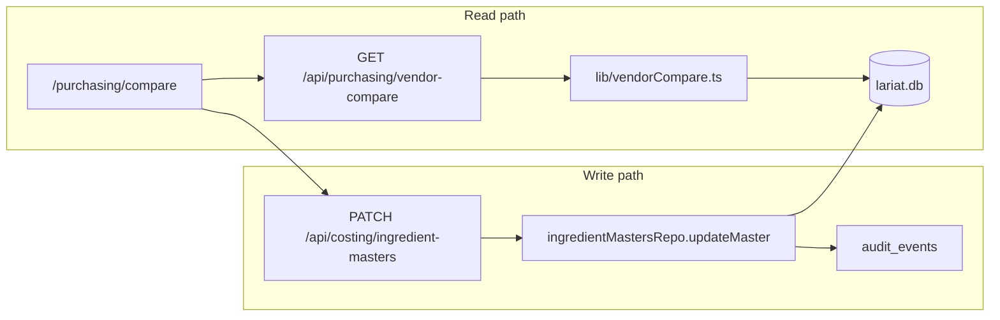

# feat: Vendor compare and quality locks (Sysco vs Shamrock)

## Summary

Ship a manager-facing **vendor compare** page under Purchasing: side-by-side normalized unit prices for mapped Sysco↔Shamrock pairs, cheaper-alternate highlighting on unlocked rows, and **quality lock** + **preferred vendor** writes on `ingredient_masters` (PIN-gated, audit-backed). Reuse existing costing normalization primitives; do not auto-sync `order_guide_items` in v1.

## Problem Frame

On order day the KM manually compares Sysco vs Shamrock for closest equivalents and fair pack-normalized prices, then mentally tracks quality overrides. Lariat already ingests both vendor catalogs and links some rows via `ingredient_masters`, but `/purchasing` is a flat read-only order guide with no cross-vendor view. `PATCH /api/costing/ingredient-masters` can set `preferred_vendor` today; quality locks and a compare surface do not exist.

(see origin: `docs/brainstorms/2026-06-17-vendor-compare-quality-locks-requirements.md`)

## Requirements traceability

| Origin | Plan coverage |
|--------|----------------|
| R1–R5 Compare display | U2, U4 |
| R6–R9 Lock + preferred vendor | U1, U3, U4 |
| R10–R11 Mapped-only + coverage | U2, U4 |
| R12–R13 Manager actor + copy rules | U4, U5 |
| SC1–SC4 Success criteria | U2 tests, U3 tests, U6 ingest test |
| OQ1 Lock authority | KTD2 — PIN-gated (existing middleware) |
| OQ2 Order guide coupling | KTD4 — master-only v1 |
| OQ3 Locked display | KTD5 — show both prices; disable switch |

## Key Technical Decisions

| ID | Decision | Rationale |
|----|----------|-----------|
| KTD1 | **Pure compare module** `lib/vendorCompare.ts` | Keeps normalization testable without Next.js; mirrors `costingBenchmarks.mjs` / `rollupRecipeCosts.ts` unit bridges. |
| KTD2 | **PIN-gated writes** via existing `requirePin` + `middleware.js` on `/purchasing` | Matches `ingredient-masters` PATCH and manager write posture; no new auth model. |
| KTD3 | **Extend `ingredient_masters`** with `quality_locked` (INTEGER 0/1) + `quality_lock_reason` (nullable TEXT) | Explicit lock separate from `preferred_vendor`; ingest already preserves operator `preferred_vendor` on conflict update (`scripts/ingest-costing.mjs`). |
| KTD4 | **Master record only in v1** — no `order_guide_items` sync | STRATEGY: workbook stays human layer; `order_guide_items` vendor column is ingest-owned. Compare writes pin `preferred_vendor` for costing/merged-cost; purchasing page can add a “preferred” badge later. |
| KTD5 | **Locked rows show both normalized prices**; switch/unlock actions disabled | Origin synthesis default; KM still sees market spread without encouraging override. |
| KTD6 | **Comparable vendors = `sysco` and `shamrock`** (case-insensitive) | Matches repo fixtures and ingest scripts; no US Foods in v1. |
| KTD7 | **Normalization basis:** prefer `reconciled_unit_price` when present, else `unit_price`; cross-pack alignment via `convertPackSizeToLineUnit` to a shared canonical unit (`lb` for weight dimension, else matching `pack_unit` only) | Reuses `lib/unitConvert.mjs`, `ingredient_densities`, `ingredient_unit_weights`; honest `cannot_compare` when bridge missing (R3). |
| KTD8 | **Writes through `updateMaster`** in `lib/ingredientMastersRepo.ts` | Existing `audit_events` `correction` row per mutation; extend `MasterUpdates` rather than ad-hoc SQL in routes. |

## High-Level Design



**Compare row eligibility:** `ingredient_masters` row with `master_id` linked to ≥1 `vendor_prices` row per vendor (`sysco`, `shamrock`), using latest row per vendor (`imported_at DESC, id DESC`).

**Cheaper highlight:** On unlocked rows, if normalized unit price of non-preferred vendor is lower than preferred (or no preferred set), flag `cheaper_alternate`.

## Scope Boundaries

### In scope

- Schema migration for quality lock columns.
- `lib/vendorCompare.ts` + GET API + `/purchasing/compare` UI.
- PATCH extensions for `quality_locked`, `quality_lock_reason`, `preferred_vendor` with lock enforcement.
- Coverage summary (count of mapped pairs vs vendors-without-pair).
- Node tests with realistic vendor price fixtures.

### Deferred for later

- Equivalence-mapping UI for unmapped catalog items.
- Order guide row sync on preference change.
- Morning digest / management tile nudges.
- Native macOS compare surface.
- LaRi conversational compare.

### Outside identity

- Automated vendor ordering APIs.

## Risks and Dependencies

| Risk | Mitigation |
|------|------------|
| Thin `master_id` coverage | Coverage indicator on page; seed/compare fixtures from existing `tests/js/test-ingredient-masters*.mjs` patterns. |
| Normalization false positives across incompatible packs | Return `compare_status: 'cannot_compare'` with short reason code; never render a guessed dollar amount. |
| Lock bypass via PATCH | Repo rejects `preferred_vendor` change when `quality_locked=1` unless `quality_locked` cleared in same txn. |
| Ingest reverts lock columns | Omit lock fields from ingest upsert `ON CONFLICT` update clause (mirror `preferred_vendor` pattern). |

**Depends on:** Fresh Shamrock/Sysco ingest before order-day use; existing PIN setup for manager laptop.

## Implementation Units

### U1. Schema: quality lock columns

**Goal:** Persist operator quality locks without ingest clobbering.

**Touch:**
- `lib/db.ts` — `ingredient_masters` CREATE + migration ALTERs
- `tests/js/test-schema-migrations.mjs`

**Steps:**
1. Add `quality_locked INTEGER NOT NULL DEFAULT 0` and `quality_lock_reason TEXT` (nullable, max 80 chars at API).
2. Extend `assertCriticalSchemas` / migration tests.
3. Document in `IngredientMasterRow` JSDoc that lock implies `preferred_vendor` should match locked vendor.

**Test scenarios:**
- Fresh DB has columns with correct nullability/defaults.
- Re-init schema on legacy DB applies ALTER without data loss.

---

### U2. Compare computation module

**Goal:** Pure functions listing comparable masters and normalized prices.

**Touch:**
- `lib/vendorCompare.ts` (new)
- `tests/js/test-vendor-compare.mjs` (new)

**Exports (indicative):**
- `listVendorCompareRows(db, { locationId, limit })` → array of compare DTOs
- `computeComparableUnitPrice(vendorRow, opts)` → `{ price, unit, status, reason }`

**DTO fields per master:** `master_id`, `canonical_name`, `preferred_vendor`, `quality_locked`, `quality_lock_reason`, `sysco`/`shamrock` offer snapshots (sku, pack display, normalized price), `compare_status`, `cheaper_vendor`, `coverage_note`.

**Test scenarios (use realistic chicken/avocado-style fixtures, not `foo`/`bar`):**
- Mapped pair, same weight unit → normalized prices match `pack_price/pack_size` within tolerance.
- `reconciled_unit_price` wins over `unit_price` when set.
- Mismatched dimensions without density → `cannot_compare`.
- Only one vendor present → row excluded from compare list (R10).
- Cheaper alternate flagged only when unlocked.

---

### U3. APIs: read compare + extend master PATCH

**Goal:** HTTP surface for compare read; lock-aware writes.

**Touch:**
- `app/api/purchasing/vendor-compare/route.js` (new) — GET, PIN via middleware
- `app/api/costing/ingredient-masters/route.js` — accept `quality_locked`, `quality_lock_reason` in PATCH body
- `lib/ingredientMastersRepo.ts` — extend `updateMaster` with lock rules
- `tests/js/test-vendor-compare-api.mjs` (new)
- `tests/js/test-ingredient-masters-api.mjs` — lock cases

**Lock rules in repo:**
- Setting `quality_locked: true` requires `preferred_vendor` (set in same PATCH or already present); optional `quality_lock_reason`.
- While `quality_locked=1`, reject `preferred_vendor` changes unless `quality_locked: false` in same request.
- Unlock is explicit (`quality_locked: false`); clears reason optional.

**Test scenarios:**
- GET returns compare rows for seeded pair.
- PATCH set preferred vendor on unlocked master → 200 + audit row.
- PATCH preferred vendor on locked master → 422 with line-cook error copy.
- PATCH lock + preferred in one request → persists both.
- PIN missing → 401 (existing pattern).

---

### U4. Purchasing compare UI

**Goal:** Order-day KM workflow on iPad/laptop.

**Touch:**
- `app/purchasing/compare/page.jsx` (new)
- `app/purchasing/page.jsx` — link “Compare vendors” (or “Sysco vs Shamrock”)
- Client actions component for Set preferred / Lock for quality / Unlock (calls PATCH)

**UX (per `docs/UI_COPY_RULES.md`):**
- Table: ingredient name, Sysco $/unit, Shamrock $/unit, preferred, lock badge.
- Unlocked + cheaper alternate: subtle highlight on lower price cell (not alarm red).
- Locked: both prices visible; actions = Unlock only (+ view reason).
- Cannot compare: “—” + short reason (“different pack” / “need weight bridge”).
- Coverage line at top: “X staples mapped · Y not compared yet”.

**Test scenarios:**
- `app/__tests__/PurchasingCompare.test.jsx` (optional if pattern exists) OR rely on API tests + manual checklist — prefer API contract tests as gate.

---

### U5. Ingest durability test

**Goal:** Prove SC4 — re-ingest does not clear locks or preferred vendor.

**Touch:**
- `tests/js/test-ingredient-masters-ingest-lock.mjs` (new) or extend existing ingest test

**Test scenario:**
- Seed master with `preferred_vendor='shamrock'`, `quality_locked=1`.
- Run T7 upsert path from `ingest-costing.mjs` helper (or minimal SQL mirroring ON CONFLICT clause).
- Assert lock + preferred unchanged.

---

## Verification

From repo root:

```bash
npm run verify          # full gate before PR
node --experimental-strip-types --test tests/js/test-vendor-compare.mjs tests/js/test-vendor-compare-api.mjs tests/js/test-ingredient-masters-api.mjs tests/js/test-schema-migrations.mjs
```

**Manual smoke:** After ingest, open `/purchasing/compare` on LAN laptop; set lock on one staple; re-run `npm run ingest:costing`; confirm lock persists.

## Sequencing

1. U1 (schema) → U2 (pure logic) → U3 (API) → U4 (UI) → U5 (ingest durability)
2. Single PR on `feat/vendor-compare-quality-locks` worktree recommended (multi-file, one feature).

## Assumptions

- Sufficient mapped staples exist today to justify v1; if coverage is near zero, ship UI anyway with honest empty/coverage state and prioritize mapping work as follow-up brainstorm.
- Manager accesses compare from PIN-protected `/purchasing` routes on kitchen laptop (not cook iPad tier).

## Sources

- `docs/brainstorms/2026-06-17-vendor-compare-quality-locks-requirements.md`
- `lib/ingredientMastersRepo.ts`, `app/api/costing/ingredient-masters/route.js`
- `lib/costingBenchmarks.mjs` (`resolveMergedCost`)
- `scripts/ingest-costing.mjs` (preferred_vendor preserve)
- `STRATEGY.md` ops data plane track
