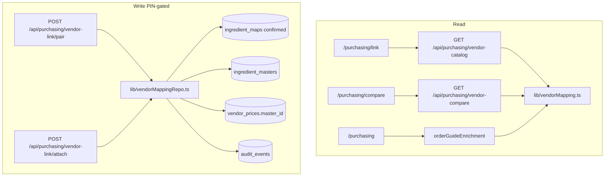

# feat: Vendor compare v2 — catalog mapping + order guide badges

## Summary

Ship **manual Sysco↔Shamrock linking** (pair + attach) and **order guide badges** (preferred, lock, mismatch) so the KM can grow compare coverage and see preference drift without re-ingest or workbook edits. Builds on v1 compare (#358); no fuzzy matching, no `order_guide_items` vendor sync, no nudges.

## Problem Frame

v1 compare only lists masters with **both** vendors linked. The KM still maps equivalents outside Lariat and cannot see preferred/lock state on the flat order guide. v2 closes the coverage loop: link catalog rows in-app → staple appears on compare → guide shows when ingest vendor disagrees with preference.

(see origin: `docs/brainstorms/2026-06-17-vendor-compare-v2-mapping-requirements.md`)

## Requirements traceability

| Origin | Plan coverage |
|--------|----------------|
| R1 Pair-from-scratch | U3, U4, U5 |
| R2 Attach missing vendor | U2, U6, U7 |
| R3 Mapping durability | U1, U8 |
| R4 Order guide visibility | U9 |
| R5 Coverage UX | U2, U6, U7 |
| R6 Copy / audience | U4–U7, U9 |
| SC1–SC2 | U5, U7 tests |
| SC3 | U8 |
| SC4 | U9 tests |
| SC5 | KTD4 (no auto-link) |
| OQ1 Write path | KTD1, KTD2 |
| OQ2 Guide match key | KTD5 |
| OQ3 master_id slug | KTD3 |

## Key Technical Decisions

| ID | Decision | Rationale |
|----|----------|-----------|
| KTD1 | **Link writes = confirmed `ingredient_maps` + `ingredient_masters` upsert + `vendor_prices.master_id` update** | `rebuildIngredientMasters` only backfills `master_id WHERE NULL` from confirmed maps (`scripts/ingest-costing.mjs`); operator links must land in both places for ingest parity. |
| KTD2 | **Ingest preserves operator `master_id` across vendor_prices DELETE+INSERT** | Costing ingest wipes food `vendor_prices` each run; without a pre-delete `(location_id, vendor, sku) → master_id` snapshot reapplied after INSERT, in-app links would vanish until maps backfill. Extend `ingest-costing.mjs` (same pattern as curated map status snapshot). |
| KTD3 | **`master_id = deriveMasterId(canonical_name)`** | Reuse `lib/ingredientKey.ts`; UI shows canonical name only. Collision → 409 with “already linked” copy. |
| KTD4 | **Catalog picker keys on `(vendor, sku, ingredient)` not `vendor_prices.id`** | IDs change every ingest sweep; stable keys survive re-ingest. |
| KTD5 | **Order guide join: `order_guide_items.ingredient` + normalized `vendor`** → latest `vendor_prices` row → `master_id` → `ingredient_masters` | No SKU on order guide; document ambiguous duplicate-ingredient edge case in tests. |
| KTD6 | **PIN-gated POST** under `/api/purchasing` | Matches v1 compare PATCH posture (`middleware.js`). |
| KTD7 | **Audit: one `correction` per affected entity** | `ingredient_maps` insert + each `vendor_prices` master_id change + master upsert — same txn pattern as `ingredientMastersRepo.updateMaster`. |

## High-Level Design



**Pair flow:** KM picks Sysco + Shamrock catalog rows + canonical name → repo upserts master, inserts two confirmed maps (`recipe_ingredient` = canonical, `vendor_ingredient` = each catalog `ingredient`), sets `master_id` on both latest vendor price rows.

**Attach flow:** KM picks single-vendor master + opposite-vendor catalog row → one confirmed map + one `vendor_prices` update.

## Scope Boundaries

### In scope

- `lib/vendorMapping.ts` (read) + `lib/vendorMappingRepo.ts` (audited writes)
- APIs: catalog search, pair, attach; extend compare GET with `single_vendor_masters` + coverage counts
- `/purchasing/link`, compare attach section, order guide badges
- Ingest `master_id` carry-forward + tests

### Deferred (v3+)

- Morning digest / management nudges
- `order_guide_items.vendor` sync
- US Foods, LaRi mapping, native macOS

### Outside identity

- Automated vendor ordering

## Implementation Units

### U1. Ingest durability — operator `master_id` carry-forward

**Goal:** SC3 — re-ingest does not strip KM-linked catalog rows.

**Touch:**
- `scripts/ingest-costing.mjs`
- `tests/js/test-vendor-mapping-ingest-durability.mjs` (new)

**Approach:** Inside the costing ingest transaction, before `DELETE FROM vendor_prices`, snapshot `Map<(location_id,vendor,sku), master_id>` for rows where `master_id IS NOT NULL`. After workbook `INSERT INTO vendor_prices`, `UPDATE vendor_prices SET master_id = @id WHERE ...` for each snapshot hit. Optionally re-merge snapshotted `ingredient_maps` rows with `status='confirmed'` not present in workbook batch (operator-only maps).

**Test scenarios:**
- Happy path: link chicken Sysco+Shamrock → run minimal ingest sweep fixture → both sides retain `master_id`.
- Edge case: snapshot key missing on re-insert (SKU dropped from vendor file) → row stays unlinked; no error.
- Edge case: beverage category rows excluded from DELETE still preserve `master_id`.

**Verification:** New durability test green; existing `test-ingredient-masters-ingest-lock.mjs` still passes.

---

### U2. Read layer — catalog search, single-vendor masters, coverage

**Goal:** Pure functions for pickers and coverage line (R5).

**Touch:**
- `lib/vendorMapping.ts` (new)
- `lib/vendorCompare.ts` (modify — export `listSingleVendorMasters`, `countUnlinkedCatalogRows` or fold into vendorMapping)
- `tests/js/test-vendor-mapping.mjs` (new)

**Exports (indicative):**
- `searchVendorCatalog(db, { vendor, q, unlinkedOnly, limit })` → latest row per `(vendor, sku)` for sysco/shamrock
- `listSingleVendorMasters(db, { locationId })` → masters with exactly one of sysco/shamrock + which vendor is missing
- `summarizeMappingCoverage(db)` → `{ mapped_pairs, single_vendor, unlinked_sysco, unlinked_shamrock }`

**Test scenarios:**
- Fixture: Sysco row with `master_id` null appears in catalog search; linked row excluded when `unlinkedOnly`.
- Single-vendor master with only Shamrock linked → listed with `missing_vendor: 'sysco'`.
- Coverage counts match fixture cardinalities.

**Verification:** Unit tests only.

---

### U3. Write layer — `vendorMappingRepo` (pair + attach)

**Goal:** R1, R2, R3 transactional writes with audit (KTD1, KTD7).

**Touch:**
- `lib/vendorMappingRepo.ts` (new)
- `tests/js/test-vendor-mapping-repo.mjs` (new)

**Approach:**
- `pairCatalogRows(db, { syscoKey, shamrockKey, canonicalName, locationId })` — validate both vendors, neither already on a conflicting master; `deriveMasterId`; upsert master; insert confirmed maps; update `vendor_prices.master_id` for latest rows matching keys.
- `attachCatalogRow(db, { masterId, catalogKey, locationId })` — master exists; catalog vendor is the missing side; reject if catalog row already linked elsewhere.
- Reject cross-vendor duplicate attach (409). Empty canonical name → 422 before txn.

**Test scenarios:**
- Happy path pair → master + 2 maps + 2 VP updates + audit rows in one txn.
- Happy path attach → 1 map + 1 VP update.
- Error: attach Shamrock row already on another master → 409, no partial writes.
- Error: pair with `deriveMasterId` collision and mismatched canonical → 409.
- Integration: rollback on audit failure leaves maps/VP unchanged.

**Verification:** Repo tests with realistic chicken/avocado-style catalog strings.

---

### U4. APIs — catalog GET, pair POST, attach POST

**Goal:** HTTP surface for link UI; PIN-gated.

**Touch:**
- `app/api/purchasing/vendor-catalog/route.js` (new) — GET
- `app/api/purchasing/vendor-link/pair/route.js` (new) — POST
- `app/api/purchasing/vendor-link/attach/route.js` (new) — POST
- `tests/js/test-vendor-mapping-api.mjs` (new)

**Test scenarios:**
- GET catalog `?vendor=sysco&q=chicken` returns seeded rows.
- POST pair without PIN → 401.
- POST pair success → subsequent GET compare includes row (SC1).
- POST attach success → compare shows both vendors (SC2).

**Verification:** API tests + `requirePin` parity with `test-vendor-compare-api.mjs`.

---

### U5. `/purchasing/link` — pair-from-scratch UI

**Goal:** R1, R5, R6.

**Touch:**
- `app/purchasing/link/page.jsx` (new)
- `app/purchasing/link/LinkPairForm.jsx` (new client component)
- `app/purchasing/page.jsx` — link to “Link vendors”

**UX:**
- Two searchable pickers (Sysco / Shamrock) + canonical name field.
- Coverage summary header (from `summarizeMappingCoverage`).
- Success → link to compare for that staple.
- No ranked “suggested matches.”

**Verification:** API tests are gate; manual smoke on LAN laptop optional.

---

### U6. Compare page — attach section + coverage links

**Goal:** R2, R5.

**Touch:**
- `app/purchasing/compare/page.jsx`
- `app/purchasing/compare/AttachVendorActions.jsx` (new)
- `app/api/purchasing/vendor-compare/route.js` — include `single_vendor_masters` in JSON (or separate GET)

**UX:**
- Section “One vendor only” below compare table with Attach action per row.
- Empty compare CTA → `/purchasing/link` (not “costing first”).
- Subtitle uses expanded coverage counts.

**Verification:** Attach API test + manual attach → row moves to compare table.

---

### U7. Compare attach UI wiring

**Goal:** Complete R2 client flow.

**Dependencies:** U3, U4, U6

**Touch:** `AttachVendorActions.jsx` — modal/sheet with catalog search for missing vendor only.

**Test scenarios:** (API-level) attach from single-vendor master id in fixture.

---

### U8. Ingest + repo integration test (SC3 end-to-end)

**Goal:** Full ingest simulation after operator link.

**Dependencies:** U1, U3

**Touch:** `tests/js/test-vendor-mapping-ingest-durability.mjs`

**Scenario:** Pair via repo → invoke exported ingest sweep helper (or minimal copy of snapshot/reapply block) → assert `master_id` on both vendor+sku keys.

---

### U9. Order guide badges

**Goal:** R4, SC4.

**Touch:**
- `lib/orderGuideEnrichment.ts` (new)
- `app/purchasing/page.jsx`
- `tests/js/test-order-guide-enrichment.mjs` (new)

**Approach:** For each `order_guide_items` row, resolve latest `vendor_prices` by `(ingredient, vendor, location_id)`; join `ingredient_masters`; emit `{ preferred_vendor, quality_locked, quality_lock_reason, vendor_mismatch }`. Render badges in new column — preferred label, lock icon, mismatch warning (subtle, not alarm red).

**Test scenarios:**
- Guide row Shamrock + master preferred Sysco → `vendor_mismatch: true`.
- Locked master → lock badge.
- No VP/master link → no badges.
- Duplicate ingredient strings across vendors → document first-match behavior in test comment.

**Verification:** Unit tests on enrichment function.

---

## Risks and Dependencies

| Risk | Mitigation |
|------|------------|
| Ingest DELETE wipes links | U1 snapshot reapply (KTD2) |
| Stable picker identity | KTD4 vendor+sku keys |
| `deriveMasterId` collision | 409 + clear copy |
| Thin initial coverage | Coverage UX + link CTA; honest empty states |
| Guide join ambiguity | KTD5 + documented test for duplicate ingredient |

**Depends on:** v1 compare on `main` (#358); PIN configured; Shamrock/Sysco ingest current.

## Sequencing

1. U1 (ingest durability) + U2 (read) in parallel after U1 snapshot design frozen
2. U3 (repo) → U4 (API)
3. U5 (link page) + U6/U7 (compare attach) — can split PRs but single feature branch OK
4. U8 (durability integration) before merge
5. U9 (order guide) last — independent of link writes

**`/ce-work` default:** U1 → U2 → U3 → U4 → U5/U6 → U8 → U9 (one worktree, one PR acceptable).

## Verification

```bash
npm run verify
node --experimental-strip-types --test \
  tests/js/test-vendor-mapping.mjs \
  tests/js/test-vendor-mapping-repo.mjs \
  tests/js/test-vendor-mapping-api.mjs \
  tests/js/test-vendor-mapping-ingest-durability.mjs \
  tests/js/test-order-guide-enrichment.mjs
```

**Manual:** Link one real staple → compare shows both sides → set preferred on compare → order guide shows mismatch if guide vendor differs → re-run `npm run ingest:costing` → link survives.

## References

- Origin: `docs/brainstorms/2026-06-17-vendor-compare-v2-mapping-requirements.md`
- v1 plan: `docs/plans/2026-06-17-005-feat-vendor-compare-quality-locks-plan.md`
- Ingest: `scripts/ingest-costing.mjs` (`rebuildIngredientMasters`, curated map snapshot)
- Patterns: `lib/ingredientMastersRepo.ts`, `lib/auditEvents.ts`, `docs/UI_COPY_RULES.md`
- Slug: `lib/ingredientKey.ts` (`deriveMasterId`)
